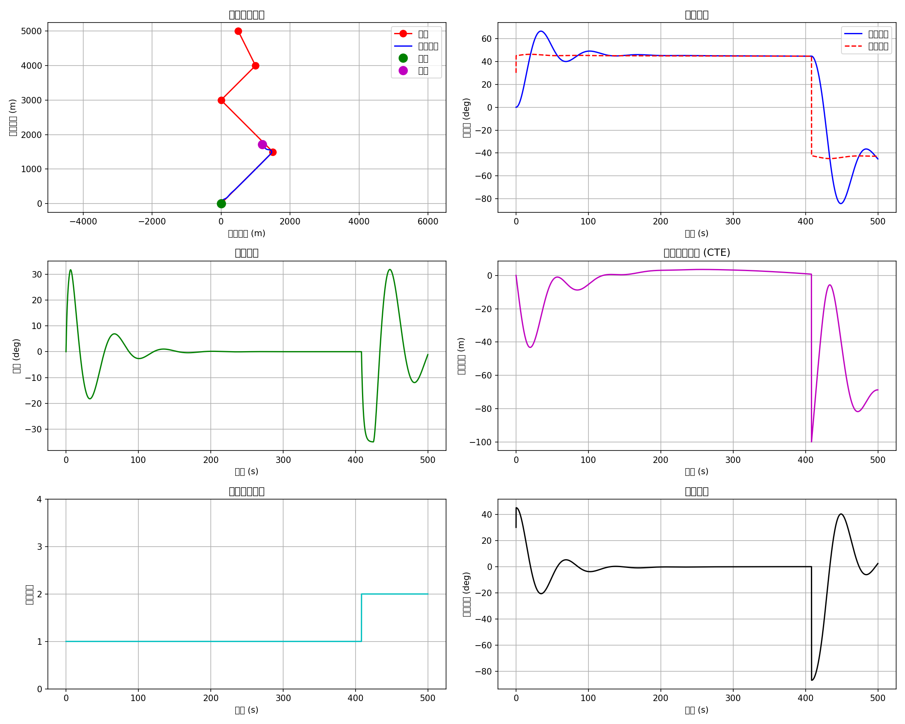
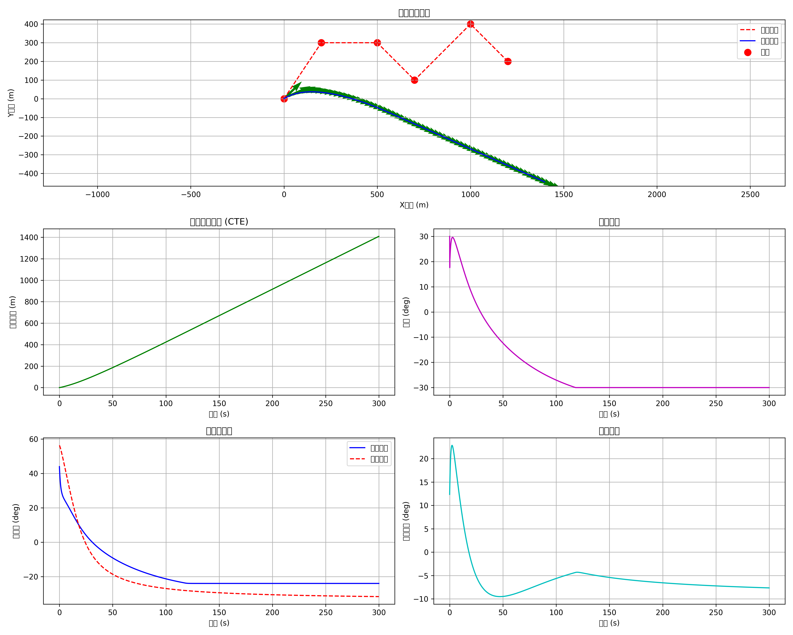
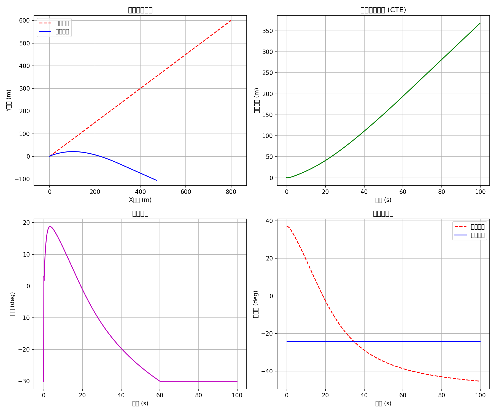

# Ship Motion Modeling

<div align="center">

**船舶运动控制与仿真系统** — 实现多种经典船舶运动模型和控制算法

[](https://www.python.org/)
[](LICENSE)
[](https://github.com/beahanbarry291994-cmd/ship-motion-modeling/stargazers)


<p><em>基于 KT 方程的船舶旋回运动仿真结果</em></p>

</div>

---

## Features

- **多种船舶运动模型** — KT (Nomoto)、MMG、Abkowitz 三种经典模型
- **PID 航向控制器** — 支持航向跟踪和旋回实验
- **丰富的可视化** — 轨迹图、时序图、相平面图等
- **MATLAB/Simulink 支持** — 模糊控制器和 Simulink 模型
- **模块化设计** — 易于扩展和二次开发

## Demo

### 旋回运动仿真

<div align="center">


<p><em>左：船舶路径跟踪 | 右：跟踪结果分析</em></p>
</div>

### 航向控制

<div align="center">

<p><em>PID 航向保持控制仿真</em></p>
</div>

## Project Structure

```
ship-motion-modeling/
├── KT.py                    # KT 方程船舶旋回仿真
├── MMG.py                   # MMG 模型船舶运动仿真
├── PIDKT.py                 # PID + KT 模型航向控制
├── PID_course.py            # PID 航向控制器 (Nomoto 模型)
├── test.py                  # 旋回实验仿真
├── test0615.py              # Abkowitz 模型旋回仿真
├── fuzzycontroller.m        # MATLAB 模糊控制器
├── sllookuptable.slx        # Simulink 模型
│
├── docs/                    # 文档和图片
│   └── images/              # 仿真结果图片
│
└── 论文文献/                 # 参考文献
```

## Quick Start

### Prerequisites

```bash
pip install numpy matplotlib scipy
```

### Run

```bash
# KT 模型旋回仿真
python KT.py

# MMG 模型仿真
python MMG.py

# PID 航向控制
python PIDKT.py

# 旋回实验
python test.py

# Abkowitz 模型仿真
python test0615.py
```

### MATLAB/Simulink

```matlab
% 运行模糊控制器
fuzzycontroller

% 打开 Simulink 模型
open('sllookuptable.slx')
```

## Algorithm Overview

### 1. KT 模型 (Nomoto 模型)

一阶响应模型，描述船舶对舵角的响应特性：

$$T\ddot{\psi} + \dot{\psi} = K\delta$$

- **K** — 旋回性指数 (turning ability)
- **T** — 追随性指数 (response time)
- **δ** — 舵角

### 2. MMG 模型

Maneuvering Modeling Group 标准模型，考虑水动力耦合：

$$
\begin{cases}
m(\dot{u} - vr) = X \\
m(\dot{v} + ur) = Y \\
I_z\dot{r} = N
\end{cases}
$$

### 3. Abkowitz 模型

基于泰勒展开的非线性模型，适合大舵角旋回：

$$
X = X_0 + X_{vv}v'^2 + X_{vr}v'r' + X_{rr}r'^2 + ...
$$

### 4. PID 控制器

航向跟踪控制律：

$$\delta = K_p e + K_i \int e \, dt + K_d \frac{de}{dt}$$

## Model Comparison

| 模型 | 精度 | 计算量 | 适用场景 |
|:--|:--:|:--:|:--|
| KT | 低 | 小 | 快速仿真、控制器设计 |
| MMG | 中 | 中 | 一般操纵性分析 |
| Abkowitz | 高 | 大 | 精确仿真、大舵角运动 |

## Parameters

### Ship Parameters (Mariner Class)

| 参数 | 符号 | 值 | 单位 |
|:--|:--:|:--:|:--:|
| 船长 | L | 160.93 | m |
| 船宽 | B | 23.17 | m |
| 吃水 | d | 8.23 | m |
| 方形系数 | Cb | 0.559 | - |
| 质量 | m | 18442.8 | t |

### PID Gains

| 参数 | 值 | 说明 |
|:--|:--:|:--|
| Kp | 1.0 | 比例增益 |
| Ki | 0.01 | 积分增益 |
| Kd | 5.0 | 微分增益 |

## References

- Nomoto, K., et al. (1957). "On the Steering Qualities of Ships"
- Ogawa, A., Kasai, H. (1978). "On the Mathematical Model of Manoeuvring Motion of Ships"
- Abkowitz, M. A. (1964). "Lectures on Ship Hydrodynamics - Steering and Manoeuvrability"

## License

[MIT](LICENSE)
