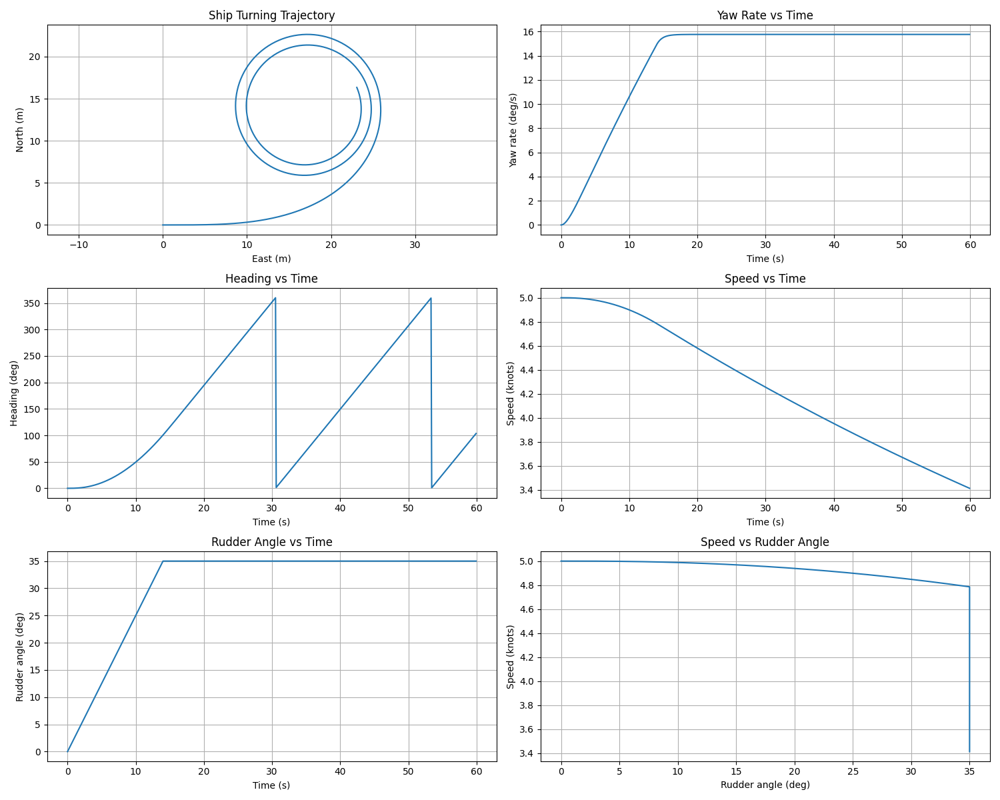

# 船舶运动控制建模

船舶运动控制与仿真系统，包含多种船舶运动模型和控制算法的实现

## 项目简介

本项目实现了船舶运动控制领域的多种经典模型和控制算法，用于船舶旋回运动仿真、航向控制等研究。

## 功能特性

- 🚢 多种船舶运动模型 (KT、MMG、Abkowitz)
- 🎮 PID 航向控制器
- 📊 旋回运动仿真与分析
- 📈 丰富的可视化输出

## 项目结构

```
船舶运动控制建模/
├── KT.py                    # KT 方程船舶旋回仿真
├── MMG.py                   # MMG 模型船舶运动仿真
├── PIDKT.py                 # PID + KT 模型航向控制
├── PID_course.py            # PID 航向控制器 (Nomoto 模型)
├── test.py                  # 旋回实验仿真
├── test0615.py              # Abkowitz 模型旋回仿真
├── fuzzycontroller.m        # MATLAB 模糊控制器
├── sllookuptable.slx        # Simulink 模型
├── ship_simulation.png      # 仿真结果图
├── ship_path_tracking.png   # 路径跟踪结果图
├── simple_ship_tracking.png # 简单跟踪结果图
└── 论文文献/                 # 参考文献
```

## 船舶运动模型

### 1. KT 模型 (Nomoto 模型)

基于一阶 Nomoto 方程的船舶旋回运动仿真

- **文件**: `KT.py`
- **特点**: 简单高效，适合快速仿真
- **参数**: 旋回性指数 K、追随性指数 T

### 2. MMG 模型

Maneuvering Modeling Group 标准模型

- **文件**: `MMG.py`
- **特点**: 高精度，考虑水动力耦合
- **参数**: 完整的水动力导数

### 3. Abkowitz 模型

基于 Abkowitz 展开的非线性船舶运动模型

- **文件**: `test0615.py`
- **特点**: 适合大舵角旋回仿真
- **参数**: Mariner 型货船参数

## 控制算法

### PID 航向控制

- **文件**: `PIDKT.py`, `PID_course.py`
- **功能**: 航向跟踪控制
- **参数**: Kp, Ki, Kd 增益参数

### 模糊控制

- **文件**: `fuzzycontroller.m`
- **平台**: MATLAB/Simulink
- **功能**: 模糊逻辑航向控制器

## 快速开始

### 环境要求

- Python 3.8+
- NumPy
- Matplotlib
- SciPy

### 安装依赖

```bash
pip install numpy matplotlib scipy
```

### 运行仿真

```bash
# KT 模型旋回仿真
python KT.py

# MMG 模型仿真
python MMG.py

# PID 航向控制
python PIDKT.py

# 旋回实验
python test.py

# Abkowitz 模型仿真
python test0615.py
```

### MATLAB/Simulink

1. 打开 MATLAB
2. 运行 `fuzzycontroller.m` 进行模糊控制仿真
3. 打开 `sllookuptable.slx` 进行 Simulink 仿真

## 仿真结果

### 旋回轨迹



### 路径跟踪


## 参考文献

- 船舶操纵性与控制
- 船舶运动数学模型
- PID 控制理论与应用

## 许可证

本项目仅供学术研究使用
